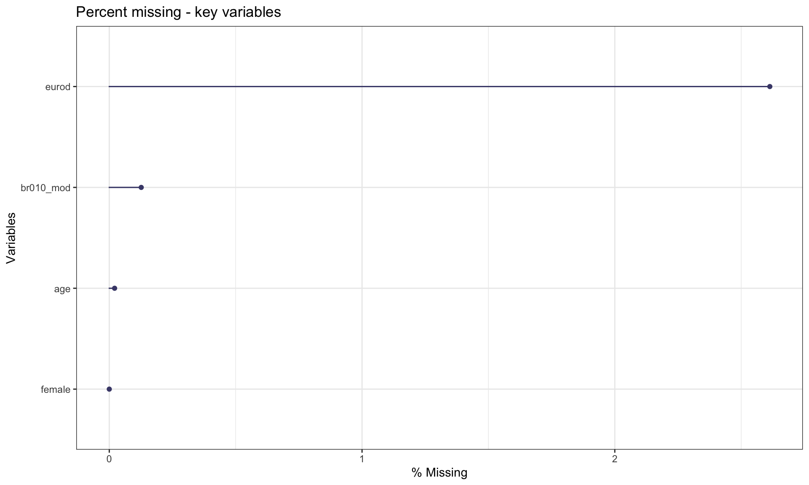
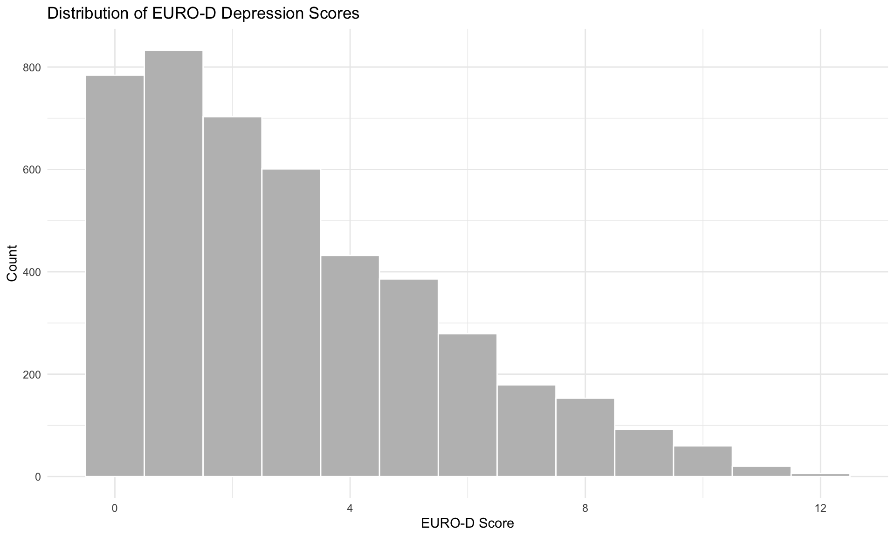
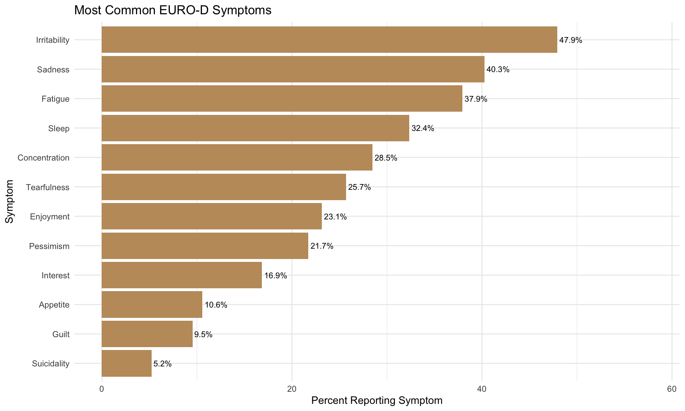
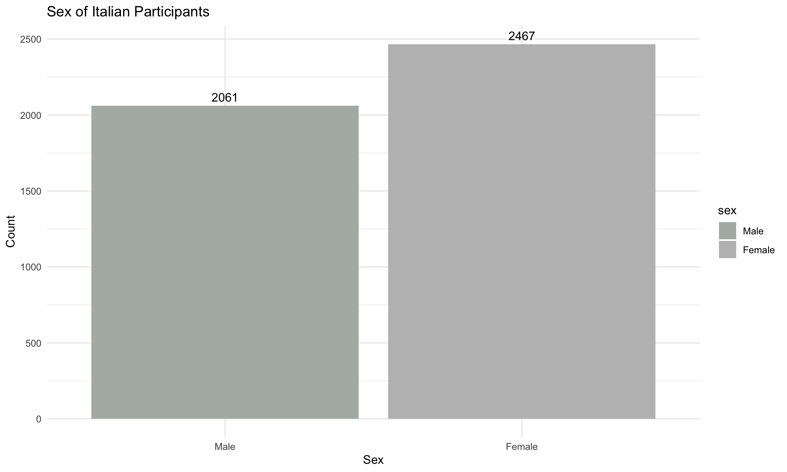
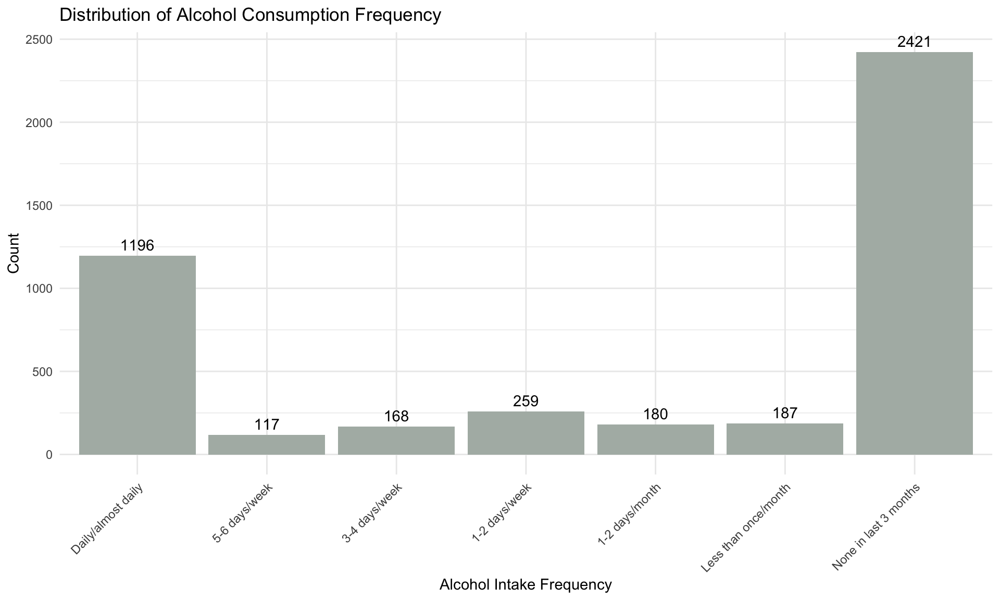
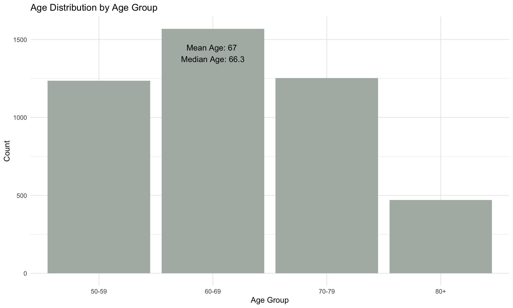
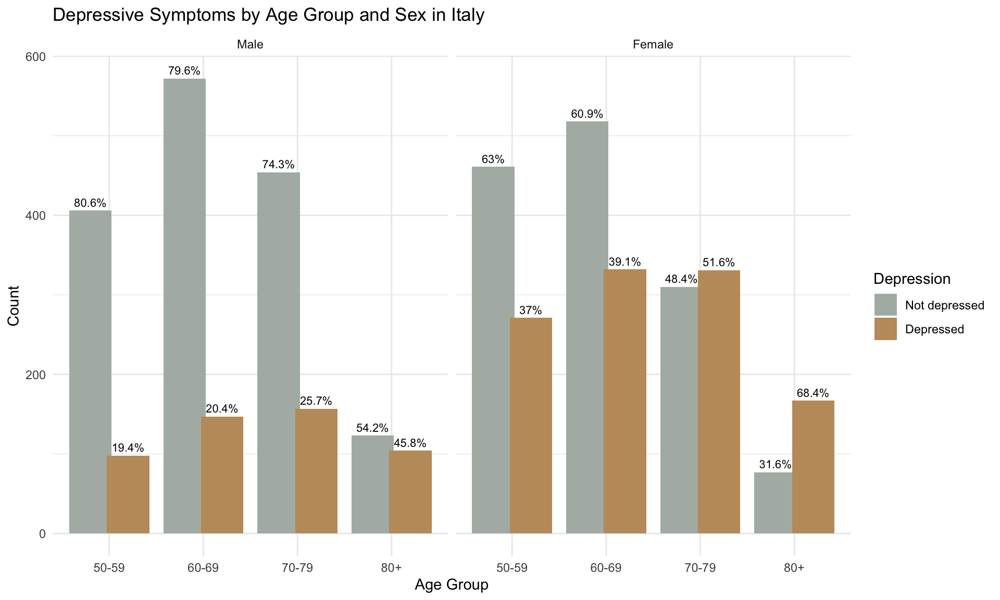
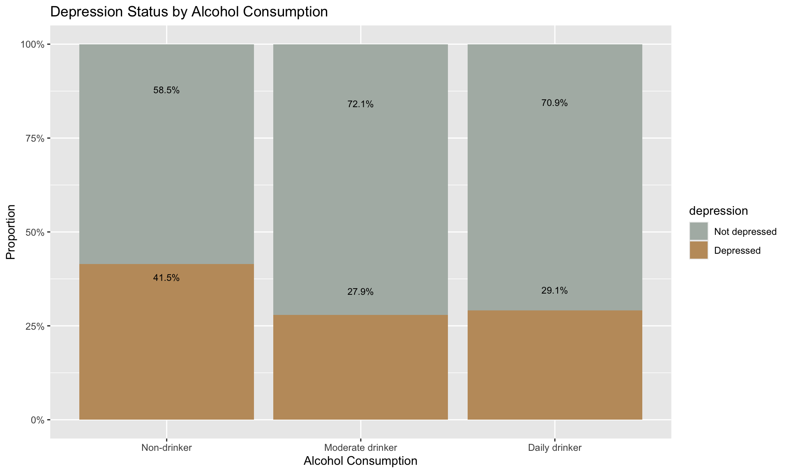
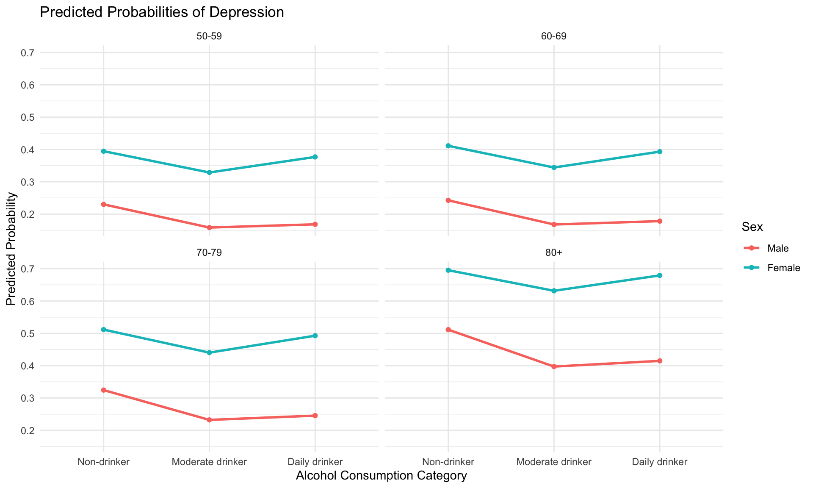

# Depression Study: Alcohol Intake and Depression Among Italians 50+

**Author:** Andjela Vucic  
**Date:** 2025-06-01  

---

## Introduction

### Aim of the analysis
The aim of this analysis is to investigate the relationship between alcohol intake frequency and the presence of depressive symptoms among adults aged 50 and above in Italy. Specifically, it explores whether different patterns of alcohol consumption are linked to self-reported depression.

### Target population
Individuals aged 50 and older residing in Italy who participated in Wave 5 of the SHARE study.

### Sample selection
The sample includes all Italian respondents from Wave 5 with valid responses for:

- `eurod` (depression indicator)  
- `br010_mod` (alcohol intake frequency)  

Only cases with non-missing values are retained.

#### EURO-D Depression Scale
`eurod` ranges from 0 to 12. Scores ≥ 4 indicate clinically relevant depression.

| Value | Meaning             |
|-------|-------------------|
| -2    | Refusal           |
| -1    | Don't know        |
| 0     | Not depressed     |
| 1–11  | Intermediate      |
| 12    | Very depressed    |

#### Alcohol Intake Categories

| Value | Meaning                        |
|-------|--------------------------------|
| -2    | Refusal                        |
| -1    | Don't know                     |
| 1     | Daily/almost every day         |
| 2     | Five or six days a week        |
| 3     | Three or four days a week      |
| 4     | Once or twice a week           |
| 5     | Once or twice a month          |
| 6     | Less than once a month         |
| 7     | Not at all in the last 3 months|

### Outcome and explanatory variable
- **Outcome:** Depression (EURO-D ≥4)  
- **Explanatory variable:** Alcohol intake frequency (`alcohol_intake`)  
- **Covariates:** Age group, sex  

### Statistical analysis
- Initial data analysis (structure, missingness, univariate insights)  
- Multivariate analysis (logistic regression, interaction analysis)  

---

## Initial Data Analysis

### Missingness

Only a few answers are missing. Among 4744 participants:

- 2.61% missing EURO-D responses  
- 0.1% missing alcohol frequency  

### Univariate Descriptions

#### EURO-D Depression
Distribution of EURO-D scores among participants:

Most commonly reported symptoms:

#### Sex

#### Alcohol Consumption

#### Age

---

## Multivariate Analysis

### Depression by Age and Sex

### Alcohol Intake by Age Group
*Heatmap is interactive in QMD, not in Markdown.*

---

## Results

### Depression by Alcohol Intake

Observation: Non-drinkers have the highest rate of depression. Moderate and daily drinkers report lower depression rates.

### Predicted Probabilities of Depression

---

## Logistic Regression Summary

- **Males:** Moderate and daily drinking associated with lower odds of depression. Older age increases odds.  
- **Females:** Moderate drinking decreases odds; daily drinking slightly increases odds (not statistically significant).  
- Interaction analysis suggests the association differs by sex.

---

## Limitations

- Lack of data on medication or past drinking habits.  
- Small sample sizes in some drinking categories, especially daily-drinking women.  
- Not longitudinal: cannot infer causality between alcohol and depression.  

